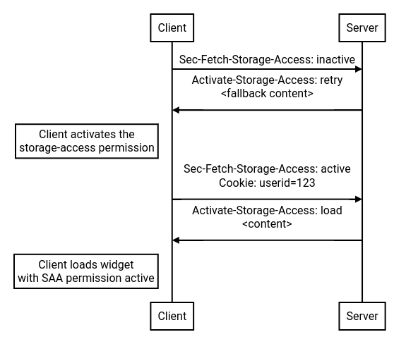
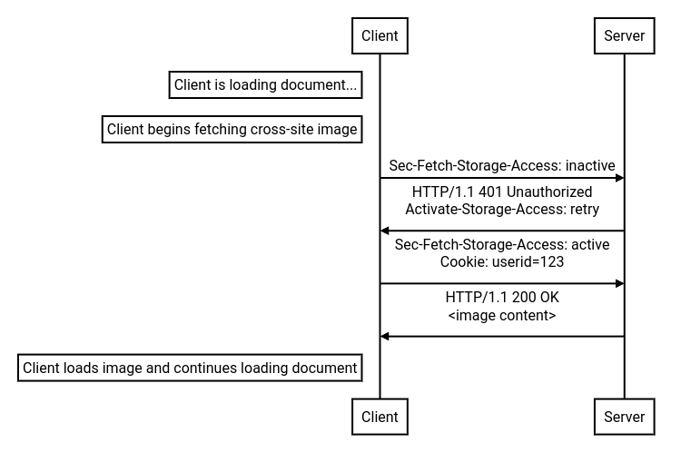

# Storage Access API Headers

## Authors

* Chris Fredrickson (cfredric@chromium.org)
* Johann Hofmann (johannhof@chromium.org)

## Goals

* Enable authenticated embedded functionality with lower latency/overhead when possible, by supporting HTTP request response headers related to the Storage Access API.
  * Provide a way to use existing permission grants during document load: https://github.com/privacycg/storage-access/issues/170.
  * Provide a way for the User Agent to indicate whether a network request comes from a context that has opted-in/activated storage access already: https://github.com/privacycg/storage-access/issues/130.
  * Provide a way for the User Agent to indicate whether a network request comes from a context that has `storage-access` permission already (but has not opted in yet).
  * Provide a way for the server to indicate that the User Agent should retry the request after opting into storage access, if possible.
* Ensure that security and privacy are not regressed as a result of this proposal.

## Non-goals

* Providing a non-JavaScript method of _requesting_ the `storage-access` permission is not a goal.

## Introduction

The [Storage Access API](https://github.com/privacycg/storage-access) supports "authenticated embeds" by providing a way to opt in to accessing unpartitioned cookies in an embedded context. The API currently requires an explicit call to a JavaScript API to 1) potentially prompt the user for permission, and 2) explicitly indicate the embedded resource's interest in using unpartitioned cookies (as a protection against CSRF attacks by an embedder).

This requirement is unacceptable for some authenticated embed use cases, and imposes a cost on even the well-suited use cases after they have obtained permission:
* Use of the Storage Access API may currently require multiple network round trips and multiple resource reloads before the embed can work as expected.
* Embedded resources currently must execute JavaScript in order to benefit from this API. This effectively means that the embedded resource must be an iframe, or must be a subresource of an embedded iframe.

These costs and constraints can be avoided by supporting a few new headers.

## Example

### Embedded `<iframe>`

#### Status quo

As an illustrative example, consider a calendar widget on calendar.com, embedded in example.com. During the user's first-ever visit to the example.com page, the flow of events is the following:

1. The user agent requests the calendar widget's content.
   * The fetch of this content is uncredentialed, as the user agent is blocking third-party cookies by default (by assumption). As a result, the server must respond with a placeholder that only requests unpartitioned cookie access, and then fetches the real widget.
1. The user agent loads the placeholder widget, without giving access to unpartitioned cookies.
1. The widget placeholder calls `document.requestStorageAccess()`.
   * Note: this proposal does not include any changes to the existing requirements for obtaining permission.
1. The widget refreshes itself, after `storage-access` permission has been granted.
   * The fetch associated with this refresh is credentialed, per the [Storage Access API spec](https://privacycg.github.io/storage-access/#navigation), so the server responds with the "real" widget.
1. The user agent loads the widget, this time with access to unpartitioned cookies.
   * After this step, the widget can finally work as expected.

This is working as intended, since the user agent may choose to delegate the decision to grant `storage-access` permission to the user, and the user ought to have the benefit of context for that decision.

However, consider a subsequent visit to the example.com page, after the `storage-access` permission has already been granted by the user or user agent. Without this proposal, the flow on the subsequent visit looks exactly the same as the flow on the first visit. However, the user does not need to grant permission this time, since they have already granted permission. This means that the latency and network traffic incurred by the first iframe load, the `document.requestStorageAccess()` script execution, and the subsequent reload are entirely unnecessary.

#### New flow

Instead, we can imagine a different flow, where the user agent recognizes that the calendar widget already has `storage-access` permission and somehow knows that the widget wants to opt in to using it, so it loads the iframe with access to unpartitioned cookies. This would avoid unnecessary latency and power drain due to network traffic and script execution, leading to a better user experience. So, the flow could be:



1. The user agent requests the calendar widget's content.
    * This fetch is still uncredentialed, as before.
    * Since the request is for calendar.com in the context of example.com, and the user has already granted the `storage-access` permission in <calendar.com, example.com> contexts, the fetch includes a `Sec-Fetch-Storage-Access: inactive` header, to indicate that unpartitioned cookie access is available but not in use.
1. The server responds with a `Activate-Storage-Access: retry` header, to indicate that the resource fetch requires the use of unpartitioned cookies via the `storage-access` permission.
1. The user agent retries the request, this time including unpartitioned cookies (activating the `storage-access` permission for this fetch).
1. The server responds with the iframe content. The response includes a `Activate-Storage-Access: load` header, to indicate that the user agent should load the content with the `storage-access` permission activated (i.e. load with unpartitioned cookie access, as if `document.requestStorageAccess()` had been called).
1. The user agent loads the iframe content with unpartitioned cookie access via the `storage-access` permission.
    * After this step, the widget can work as expected.

This flow avoids loading the widget twice, and avoids executing script solely for the `document.requestStorageAccess()` call to activate the existing permission grant. It also avoids the network transmission of the "placeholder" version of the widget.

Additionally, the use of HTTP headers removes the requirement for JavaScript execution. This enables non-iframe resources to take full advantage of existing `storage-access` permission grants.

### Embedded non-`<iframe>`

Consider a document that includes an image (e.g.) which happens to be served by a different (unrelated) site.

At present, no web platform API allows loading this image via a credentialed fetch in browsers that block third-party cookies by default. So, if the image requires the user's credentials (i.e. unpartitioned cookies), then this is broken.

However, if the browser supports the headers described below (and if the user has already granted the `storage-access` permission to the appropriate `<site, site>` pair somehow - e.g. via an iframe at some point in the recent past), then this scenario is supported by the browser as in the following sequence:



Browsers that do not support the proposed headers will still receive the appropriate `401 Unauthorized` response. However, browsers that do support the proposed headers are able to retry the fetch and can send the user's credentials, since the user has already given permission for this (by assumption).

## Proposed headers

### Request headers

```
Sec-Fetch-Storage-Access: <access-status>
```
This is a [fetch metadata request header](https://developer.mozilla.org/en-US/docs/Glossary/Fetch_metadata_request_header) (with a [forbidden header name](https://developer.mozilla.org/en-US/docs/Glossary/Forbidden_header_name)), where the `<access-status>` directive is one of the following:
* `none`: the fetch's context does not have the `storage-access` permission. The header may also be omitted as a whole in this case.
* `inactive`: the fetch's context has the `storage-access` permission, but has not opted into using it.
* `active`: the fetch's context has the `storage-access` permission and has opted into using it.

### Response headers

```
Activate-Storage-Access: <token>
```
This is a [structured header](https://datatracker.ietf.org/doc/html/rfc8941) whose value is a [token](https://datatracker.ietf.org/doc/html/rfc8941#section-3.3.4) which is one of the following:
* `load`: the server requests that the user agent activate the `storage-access` permission before continuing with the load of the resource.
* `retry`: the server requests that the user agent activate the `storage-access` permission, then retry the request. The retried request must include the `Sec-Fetch-Storage-Access: active` header.

If the request did not include `Sec-Fetch-Storage-Access: inactive`, the user agent may ignore this header.

If the response includes this header, the user agent may renew the `storage-access` permission associated with the request context, since this is a clear signal that the embedded site is relying on the permission.

Note: it is tempting to try to use [Critical-CH](https://developer.mozilla.org/en-US/docs/Web/HTTP/Headers/Critical-CH) to retry the request, but this usage would be inconsistent with existing usage and patterns for Critical-CH. The `Activate-Storage-Access: retry` header requests that the user agent _change_ some details about the request before retrying; whereas Critical-CH is designed to allow the server to request more metadata about the request, without modifying it. This proposal therefore does not rely on Critical-CH.

## Key scenarios

### Revisiting a previously-allowed authenticated embed

Relative to the Storage Access API's current specification, this proposal allows the user agent to elide some unnecessary network traffic, resource loads, and script execution when a user repeatedly visits a site with an authenticated embed. This results in a few benefits:
* Less network usage
* Less CPU usage (therefore lower power consumption)
* Lower latency until the authenticated embed is usable
* Avoids jarring UX from potentially noticeable intermediate document loads inside of the embed.

### Preserving Storage Access state across (cross-site) navigation flows

Similar to the above, sites may utilize navigations to load different content or as mechanisms to authenticate users. For example, a site might want to preserve storage access status in its embeds while the user visits different top-level pages.

### Enabling an authenticated embed that relies on non-iframe subresources in the top-level page

One ability that this proposal provides is the ability for a non-iframe resource to opt into using an existing `storage-access` permission (via a header instead of JavaScript).

That ability would enable use cases like the IIIF ([cultural heritage interoperability](https://github.com/privacycg/storage-access/issues/72)) to function with a relatively minor update: each "viewer" (top-level site) needs to include an embedded iframe from the "publisher" (embedded site), perhaps on the viewer's homepage, which calls `document.requestStorageAccess()` for the publisher. Once the permission has been granted, any of the viewer's pages can include embedded `` tags from the publisher. The publisher server can then use the `Activate-Storage-Access: retry` mechanism to activate the user's existing `storage-access` permission grant without the use of JavaScript, and ask the user agent to reissue the subresource request with the appropriate cross-site auth credentials.

An important caveat: this proposal does not eliminate the need for a prior top-level interaction on the publisher (embedded) site, nor does it eliminate the need for _some_ call to `document.requestStorageAccess()` from a cross-site embedded iframe (or some other way to request the `storage-access` permission). Another proposal like [Top-Level Storage Access API Extension](https://github.com/bvandersloot-mozilla/top-level-storage-access) could help bridge that gap.

## Browser interoperability

User agents that do not support these headers, or do not wish to allow header-based opt-in, do not have to send the `Sec-Fetch-Storage-Access` header at all; servers should interpret this as equivalent to `Sec-Fetch-Storage-Access: none`, in which case scripts will need to call `document.requestStorageAccess()` before cross-site cookies can become available. The Storage Access API does not rely on support for these headers.

Importantly, this proposal does not introduce a new mechanism to _request_ storage access when an embed has not previously obtained permission, and so website developers must still implement the existing JS-based permission request flow (usually via `document.requestStorageAccess()`) to handle cases where storage access is not granted (or the browser does not reveal whether it is granted).

## Security considerations

### Opt-In signal

The biggest security concerns to keep in mind for this proposal are those laid out in https://github.com/privacycg/storage-access/issues/113. Namely: since the Storage Access API makes cross-site cookies available even after those cookies have been blocked by default, it is crucial that the Storage Access API **not** preserve the security concerns traditionally associated with cross-site cookies, like CSRF.

The principal way that the Storage Access API addresses these security concerns is by requiring an embedded cross-site resource (e.g. an iframe) to explicitly opt in to accessing cross-site cookies by calling a JavaScript API. This proposal continues in that vein by requiring embedded cross-site resources (or their servers) to explicitly opt-in to accessing cross-site cookies (by supplying an HTTP response header).

### Forbidden header name

This proposal uses a new forbidden name for the `Sec-Fetch-Storage-Access` header to prevent programmatic modification of the header value. This is primarily for reasons of coherence, rather than security, but there is a security reason to make this choice. If a script could modify the value of the header, it could lie to a server about the state of the `storage-access` permission in the requesting context and indicate that the state is `active`, even if the requesting context has not opted in to using the permission grant. This could mislead the server into inferring that the request context is more trusted/safe than it actually is (e.g., perhaps the requesting context has intentionally _not_ opted into accessing its cross-site cookies because it cannot conclude it's safe to do so). This could lead the server to make different decisions than it would have if it had received the correct header value (`none` or `inactive`). Thus the value of this header ought to be trustworthy, so it ought to be up to the user agent to set it.

## Privacy considerations

This proposal simplifies some ways in which developers can use an API that allows access to cross-site data. However, it does not meaningfully change the privacy characteristics of the Storage Access API: sites are still able to ask for the ability to access cross-site cookies; user agents are still able to handle those requests how they see fit.

The new header does expose some user-specific state in network requests which was not previously available there, namely the state of the `storage-access` permission. However, this information is not considered privacy-sensitive, for a few reasons:
* The site could have learned this information anyway by calling `navigator.permissions.query({name: 'storage-access')` and/or `document.requestStorageAccess()` in an embedded iframe.
    * Note that this information is now exposed to other kinds of embedded subresources that it wasn't previously available to, however.
* The `Sec-Fetch-Storage-Access` header's value is always none unless the relevant context would be able to access unpartitioned state after calling `document.requestStorageAccess()` without triggering a user prompt. Thus, in the cases where the `Sec-Fetch-Storage-Access` header conveys interesting information, the site in question already has the ability to access unpartitioned state. So, there's no privacy benefit to omitting the `Sec-Fetch-Storage-Access` header altogether when it's not explicitly requested by `Activate-Storage-Access: retry`.
    * Since the header only has one valid non-`active` and non-`inactive` state (namely `none`), there's no privacy benefit to omitting the `Sec-Fetch-Storage-Access` header when its value is `none`.

## Deployment considerations

Servers that begin using the `Activate-Storage-Access` header should include `Sec-Fetch-Storage-Access` in the response's [Vary](https://www.rfc-editor.org/rfc/rfc9110#field.vary) header. This prevents user agents from receiving fallback content for requests that included `Sec-Fetch-Storage-Access: active`.

## Alternative designs
### Preflight requests

It is tempting to design a preflight mechanism, so that non-idempotent (or perhaps non-[simple](https://developer.mozilla.org/en-US/docs/Web/HTTP/CORS#simple_requests)) cross-site requests can avoid ambiguity (e.g. the server would support the request if it had just included cookies, so the server responds with the `Activate-Storage-Access: retry` header). However, this idea misinterprets the purpose of CORS preflights.

CORS preflights are a security mechanism, to ensure that servers which *don't* support CORS (and likely don't expect cross-origin PUT/DELETE/etc. requests) don't receive those "dangerous" requests. In other words, the preflights play the role of a handshake, after which the server has shown that it knows how to handle non-simple cross-origin requests. (Beyond the rollout of CORS and upgrades of old non-CORS-aware servers, CORS preflights still have a role in ensuring that any cross-origin request with a custom header gets preflighted for security reasons, as well.) This is important because before CORS existed, the Same Origin Policy forbade UAs from sending non-simple cross-origin requests; so servers might reasonably assume that any non-simple request they receive must be same-origin. After CORS became available, non-simple cross-origin requests were allowed by the SOP, which breaks the server's assumption *unless* those non-simple cross-origin requests are preceded by a preflight "handshake", which older servers wouldn't support (and therefore the request would fail in a safe way).

However, the `Sec-Fetch-Storage-Access` and `Activate-Storage-Access` headers do not enable the UA to send novel, risky requests in the same way that CORS did. The `Sec-Fetch-Storage-Access` header is purely informational; it doesn't change the properties of the request. The `Activate-Storage-Access` header allows re-inclusion of cross-site cookies, which *does* have security implications - but since not all major browsers have made third-party cookies unavailable by default, servers are already written under the assumption that incoming requests may carry cross-site cookies. Therefore, no preceding preflight "handshake" is needed as a security protection.

## Stakeholder feedback/opposition

* Chrome: Implementing
* Firefox: TBD
* Safari: TBD
* Edge: TBD
* Web developers: Positive ([feature request](https://github.com/privacycg/storage-access/issues/170), [feature request](https://github.com/privacycg/storage-access/issues/130), [feature request](https://github.com/privacycg/storage-access/issues/189))

## References & acknowledgements

The existing Storage Access API specification and discussions in its GitHub issues heavily inspired this document.
